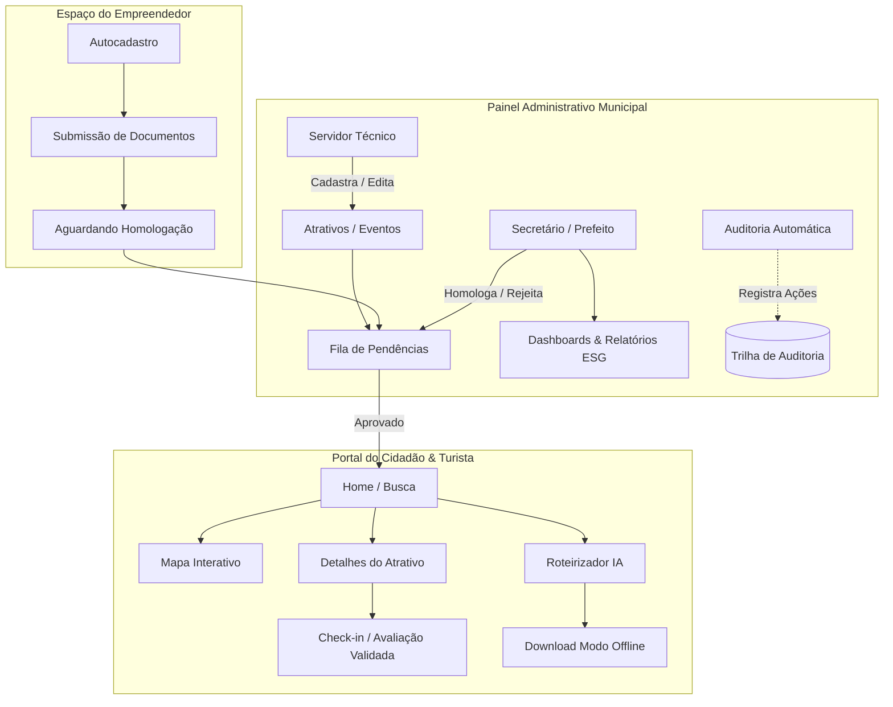

# 🗺️ Mapeamento de Funcionalidades e Casos de Uso — System-PITE

## 📖 Introdução
O **System-PITE (Plataforma Inteligente de Turismo Municipal)** é uma solução de governo digital orientada a dados, desenvolvida para transformar a gestão turística, fomentar o comércio local e proporcionar experiências personalizadas, sustentáveis e acessíveis aos visitantes. 

Este documento consolida o mapeamento exaustivo de todas as funcionalidades do sistema, seus fluxos de negócio, regras de validação e casos de uso detalhados para cada ator do ecossistema turístico.

---

## ⚙️ Funcionalidades Mapeadas

### 🌐 1. Portal Público & Experiência do Turista
- **[Busca e Filtragem de Destinos](#uc01---pesquisa-e-filtragem-de-atrativos)**: Pesquisa textual com filtros multifacetados por categorias (*Ecoturismo*, *Patrimônio Histórico*, *Gastronomia*, *Hotelaria*, *Eventos*, *Artesanato*).
- **[Mapa Turístico Interativo](#uc02---navegação-no-mapa-interativo)**: Georreferenciamento de atrativos e eventos com filtros de raio, camadas de calor e acessibilidade via Leaflet.js.
- **[Gerador de Roteiros Inteligentes (IA)](#uc03---geração-de-roteiros-inteligentes-com-ia)**: Criação algorítmica de itinerários personalizados por perfil (familiar, aventura, histórico, gastronômico), tempo disponível e orçamento estimado.
- **[Modo Offline para Roteiros](#uc04---download-e-consulta-de-roteiro-offline)**: Exportação de dados e mapas compactados para navegação em áreas remotas ou de baixa conectividade celular.
- **[Assistente Virtual & Tradução Multilíngue](#uc05---interação-com-assistente-virtual-ia)**: Chatbot integrado para tirar dúvidas sobre horários, ingressos e acessibilidade, com tradução instantânea (PT, EN, ES, FR, DE).
- **[Sistema de Avaliações e Visitas Validadas](#uc06---avaliação-e-check-in-de-visita)**: Avaliação de atrativos com notas (1 a 5 estrelas), comentários e comprovação de visita para eliminar avaliações fraudulentas (*zero fake reviews*).
- **[Acessibilidade Universal (PNE)](#uc07---navegação-com-recursos-de-acessibilidade)**: Filtro de itens de acessibilidade (rampas, braille, piso tátil, audiodescrição, intérprete de Libras) e suporte a alto contraste/tamanho de fonte.

---

### 🏪 2. Espaço do Empreendedor Local
- **[Autocadastro de Estabelecimentos](#uc08---cadastro-de-estabelecimento-pelo-empreendedor)**: Cadastro de negócios locais (hotéis, pousadas, restaurantes, agências de passeios, artesãos, guias).
- **[Painel de Desempenho do Negócio](#uc09---gestão-do-perfil-e-métricas-do-empreendedor)**: Visualização de visualizações de página, contatos recebidos, notas médias e rotas em que foi incluído.
- **[Solicitação do Selo Municipal de Qualidade](#uc10---solicitação-do-selo-de-validação-municipal)**: Envio de documentação de conformidade para homologação pela Secretaria de Turismo.

---

### 🏛️ 3. Gestão Municipal (Prefeito, Secretário e Técnico)
- **[Dashboard Executivo do Prefeito](#uc11---painel-estratégico-do-prefeito)**: Painel de indicadores estratégicos (KPIs de visitação, impacto econômico estimado, turistas únicos, tempo médio de permanência).
- **[Dashboard Tático do Secretário](#uc12---painel-operacional-da-secretaria-de-turismo)**: Acompanhamento de ocupação hoteleira, calendário de eventos, fluxo por categoria e distribuição espacial.
- **[Painel Operacional do Servidor Técnico](#uc13---gestão-cadastral-de-atrativos-e-eventos)**: CRUD completo de atrativos turísticos, pontos históricos, eventos municipais e categorias.
- **[Workflow de Aprovação e Moderação](#uc14---moderação-e-aprovação-de-cadastros)**: Fila de homologação de atrativos, eventos e estabelecimentos (aprovar, suspender, rejeitar com justificativa).
- **[Trilha de Auditoria e Conformidade LGPD](#uc15---consulta-à-trilha-de-auditoria-e-logs)**: Rastreabilidade completa de todas as alterações cadastrais (usuário, IP, data, hora, ação e diff de dados).
- **[Painel e Relatórios ESG](#uc16---gestão-e-exportação-de-indicadores-esg)**: Monitoramento dos pilares Ambiental, Social e Governança com exportação em PDF e planilhas CSV.

---

## 🔄 Fluxo de Implementação e Arquitetura



---

## 🧪 Casos de Uso Detalhados

### Ator: Turista / Cidadão

#### UC01 - Pesquisa e Filtragem de Atrativos
- **Atores**: Turista, Cidadão Visitante.
- **Pré-condições**: Acesso à internet e ao portal público.
- **Fluxo Principal**:
  1. O usuário acessa a página inicial ou a listagem `/atrativos`.
  2. O usuário informa termos de busca (ex: "Cachoeira", "Igreja Matriz") e/ou seleciona categorias.
  3. O usuário seleciona filtros adicionais: gratuidade, acessibilidade PNE e faixa de preço.
  4. O sistema consulta a base de dados filtrando apenas registros com `status = 'aprovado'`.
  5. O sistema exibe os cartões dos atrativos com foto, nota média, endereço e selos.
- **Fluxos Alternativos**:
  - *4a. Nenhum atrativo encontrado*: O sistema exibe mensagem amigável e recomenda destinos populares.
- **Pós-condições**: Lista de atrativos apresentada com paginação e ordenação por relevância.

---

#### UC02 - Navegação no Mapa Interativo
- **Atores**: Turista.
- **Pré-condições**: Navegador com suporte a JavaScript e Geolocalização (opcional).
- **Fluxo Principal**:
  1. O usuário acessa `/mapa-interativo`.
  2. O sistema carrega o mapa Leaflet com os marcadores de atrativos e eventos aprovados.
  3. O usuário clica em um marcador ou ajusta o raio de proximidade.
  4. O sistema abre o pop-up com resumo, foto, botão de rotas e link para detalhes completos.
- **Pós-condições**: Visualização espacial clara dos pontos de interesse no município.

---

#### UC03 - Geração de Roteiros Inteligentes com IA
- **Atores**: Turista.
- **Pré-condições**: Usuário na tela `/roteiros-inteligentes`.
- **Fluxo Principal**:
  1. O usuário seleciona suas preferências:
     - Perfil (*Família*, *Casal*, *Aventura/Ecoturismo*, *Cultural/Histórico*, *Gastronômico*);
     - Duração (*Manhã*, *Tarde*, *1 dia*, *Fim de semana*);
     - Orçamento estimado (*Econômico*, *Moderado*, *Premium*);
     - Necessidade de acessibilidade motora/visual.
  2. O usuário clica em "Gerar Roteiro Personalizado".
  3. O serviço `AiItineraryService` processa as regras de negócio, calcula distâncias geográficas e monta o itinerário ordenado com paradas sugeridas.
  4. O sistema apresenta o cronograma passo a passo com estimativa de tempo e custo.
- **Fluxos Alternativos**:
  - *3a. Falha no serviço de IA externa*: O sistema utiliza o algoritmo heurístico local em PHP/PostgreSQL para montar a rota sem indisponibilidade.
- **Pós-condições**: Roteiro salvo na sessão do usuário ou vinculado à conta do turista.

---

#### UC04 - Download e Consulta de Roteiro Offline
- **Atores**: Turista.
- **Pré-condições**: Roteiro gerado previamente.
- **Fluxo Principal**:
  1. O usuário clica na opção "Salvar para Uso Offline".
  2. O sistema gera um pacote JSON/LocalStorage contendo os pontos, coordenadas, instruções de texto e mapas estáticos em cache.
  3. Quando o dispositivo perde a conexão com a internet, o turista acessa `/roteiro-offline` e navega pelos dados locais.
- **Pós-condições**: O turista navega com segurança em trilhas e áreas rurais sem sinal de celular.

---

#### UC05 - Interação com Assistente Virtual (IA)
- **Atores**: Turista.
- **Fluxo Principal**:
  1. O usuário abre o chat flutuante de atendimento.
  2. Envia perguntas em linguagem natural (ex: *"Quais museus têm entrada franca aos domingos?"* ou *"Where can I find vegetarian food?"*).
  3. O `AiAssistantController` analisa o prompt, consulta o contexto dos dados do município e responde no idioma correspondente com links para os atrativos.
- **Pós-condições**: Dúvida sanada com transparência e rastreabilidade da fonte.

---

#### UC06 - Avaliação e Check-in de Visita
- **Atores**: Turista Autenticado.
- **Pré-condições**: Turista logado no portal.
- **Fluxo Principal**:
  1. Na página do atrativo, o turista clica em "Avaliar".
  2. Informa nota (1 a 5), comentário, data da visita e realiza validação de presença (geolocalização ou anexo de comprovante/foto).
  3. O sistema salva a avaliação e recalcula a nota média consolidada do atrativo.
- **Regra de Negócio**: Não é permitido criar avaliações repetidas para o mesmo atrativo no mesmo dia pelo mesmo usuário.

---

### Ator: Empreendedor Local

#### UC07 - Cadastro de Estabelecimento pelo Empreendedor
- **Atores**: Empreendedor Local (Comerciante, Hoteleiro, Guia).
- **Pré-condições**: Usuário registrado com perfil `empreendedor`.
- **Fluxo Principal**:
  1. O empreendedor acessa `/empreendedor/cadastro-estabelecimento`.
  2. Preenche razão social, nome fantasia, CNPJ/CPF, categoria, endereço completo, fotos e contatos.
  3. Informa comodidades e recursos de acessibilidade disponíveis.
  4. Submete para análise da Prefeitura.
  5. O status é gravado como `pendente`.
- **Pós-condições**: Estabelecimento entra na fila de moderação da Secretaria de Turismo.

---

#### UC08 - Solicitação do Selo de Validação Municipal
- **Atores**: Empreendedor Local.
- **Fluxo Principal**:
  1. O empreendedor anexa alvará de funcionamento, certificado CADASTUR ou licença sanitária.
  2. Solicita o "Selo Turismo Qualificado Municipal".
  3. Após análise da Secretaria, o selo é exibido no card público do estabelecimento.
- **Pós-condições**: Estabelecimento ganha destaque visual e prioridade nas recomendações.

---

### Ator: Servidor Técnico da Prefeitura

#### UC09 - Gestão Cadastral de Atrativos e Eventos
- **Atores**: Servidor Técnico (`perfil: servidor`).
- **Fluxo Principal**:
  1. O servidor acessa `/admin/atrativos/create` ou `/admin/eventos/create`.
  2. Insere título, descrição histórica/cultural, horários, coordenadas geográficas, fotos em alta resolução e itens de acessibilidade.
  3. O sistema valida os campos obrigatórios e registra a ação na tabela de `auditorias`.
  4. O registro é salvo com status `pendente` ou publicado conforme permissão.
- **Pós-condições**: Registro criado e auditado com ID do autor e timestamp.

---

### Ator: Secretário de Turismo & Prefeito Municipal

#### UC10 - Moderação e Aprovação de Cadastros
- **Atores**: Secretário de Turismo, Prefeito.
- **Fluxo Principal**:
  1. Acessa `/admin/aprovacao/pendentes`.
  2. Visualiza a lista de novos atrativos, eventos e estabelecimentos pendentes.
  3. Analisa dados e clica em **Aprovar**, **Rejeitar** ou **Suspender**.
  4. Em caso de rejeição/suspensão, insere a justificativa administrativa.
  5. O sistema notifica o solicitante e atualiza a visibilidade pública.
- **Pós-condições**: Estado do registro modificado e log registrado na trilha de auditoria.

---

#### UC11 - Painel Estratégico do Prefeito
- **Atores**: Prefeito Municipal (`perfil: prefeito`).
- **Fluxo Principal**:
  1. Acessa `/admin/dashboard`.
  2. O painel compila agregados em tempo real:
     - Total de visitas ao portal e turistas únicos;
     - Atrativos e categorias mais procurados;
     - Estimativa de receita gerada no comércio local;
     - Taxa de retorno de visitantes;
     - Gráficos de evolução temporal.
- **Pós-condições**: Subsídios analíticos para tomada de decisão e políticas públicas.

---

#### UC12 - Gestão e Exportação de Indicadores ESG
- **Atores**: Prefeito, Secretário de Turismo.
- **Fluxo Principal**:
  1. Acessa `/admin/esg-indicadores` ou `/admin/relatorios/esg-pdf`.
  2. Visualiza o cumprimento das metas ambientais (resíduos recolhidos, áreas de preservação), sociais (acessibilidade, capacitação de guias) e governança (transparência e LGPD).
  3. O sistema gera relatório estruturado em PDF/CSV para prestação de contas pública.
- **Pós-condições**: Relatório oficial emitido com assinatura digital e hash de verificação.

---

## ✅ Boas Práticas & Diretrizes Técnicas

### 1. Padrões de Código e Arquitetura
- **Estrutura MVC Estrita**: Lógica de negócio isolada em `Services`, consultas complexas em `Models`/`Scopes` e rotas protegidas por `Middlewares`.
- **Validação Dupla**: Validação de formulários no cliente (HTML5/Bootstrap) e no servidor via `FormRequests` do Laravel.
- **Trilha de Auditoria Obrigatória**: Toda mutação em entidades sensíveis (`Atrativo`, `Evento`, `Empreendedor`, `User`) gera registro em `Auditoria` com `user_id`, `operacao`, `dados_anteriores` e `dados_novos`.

```php
// Exemplo de registro de auditoria via Service / Model Observer
Auditoria::create([
    'user_id' => auth()->id(),
    'tabela' => 'atrativos',
    'registro_id' => $atrativo->id,
    'operacao' => 'APROVACAO',
    'dados_anteriores' => json_encode(['status' => 'pendente']),
    'dados_novos' => json_encode(['status' => 'aprovado']),
    'ip_address' => request()->ip(),
    'created_at' => now()
]);
```

### 2. Segurança e Conformidade LGPD
- Anonimização de dados de navegação e avaliações.
- Senhas protegidas com algoritmo `Bcrypt`/`Argon2id`.
- Sanitização de inputs para prevenção de **XSS** e consultas parametrizadas via Eloquent ORM contra **SQL Injection**.
- Proteção CSRF ativada em todas as requisições `POST`, `PUT` e `DELETE`.

---

## 📋 Checklist de Revisão e Validação

- [x] Todas as funcionalidades mapeadas com rotas e componentes correspondentes.
- [x] Atores do sistema identificados (Turista, Empreendedor, Servidor, Secretário, Prefeito).
- [x] Casos de uso descritos com pré-condições, fluxos principais, exceções e pós-condições.
- [x] Diagrama de arquitetura e fluxo de homologação incluído em formato Mermaid.
- [x] Diretrizes de conformidade LGPD e auditoria pública contempladas.
- [x] Recursos de IA auditável e acessibilidade universal (PNE/WCAG) detalhados.
