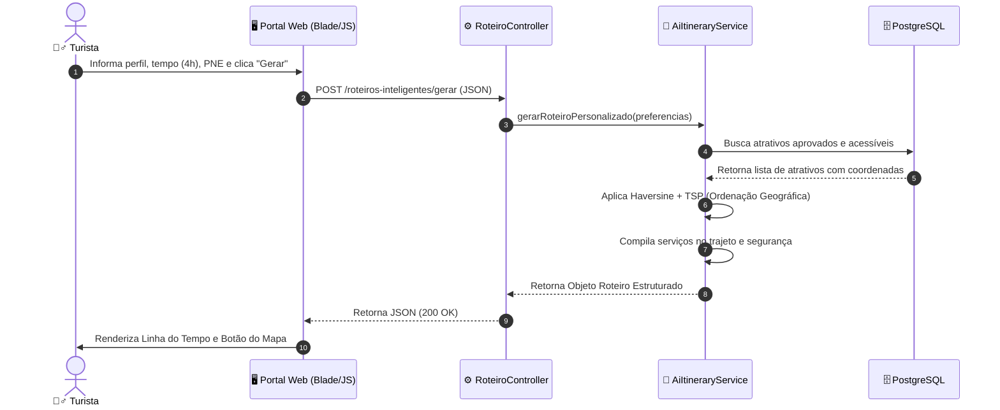
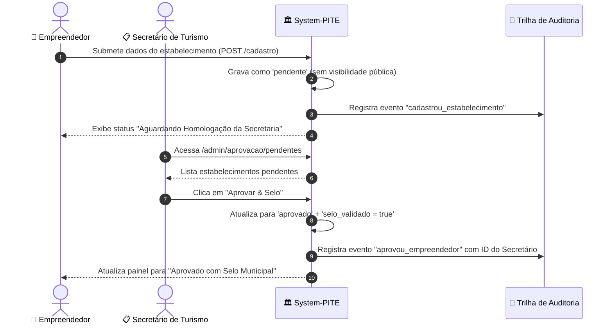

# 📐 Especificação de Casos de Uso — System-PITE
**Plataforma Inteligente de Turismo Municipal**  
*Documento de Engenharia de Requisitos e Modelagem de Casos de Uso (UML)*

---

## 👥 1. Atores do Sistema

| Ator | Descrição e Papel | Tipo de Acesso |
| :--- | :--- | :--- |
| **🚶‍♂️ Turista / Cidadão** | Visitante ou morador que busca atrativos, gera roteiros personalizados, navega no mapa, utiliza recursos offline/acessibilidade e envia avaliações. | Público / Autenticado (Conta Turista) |
| **🏪 Empreendedor Local** | Proprietário de negócio turístico (hotel, pousada, restaurante, artesão, guia) que realiza autocadastro e busca o Selo Municipal de Qualidade. | Autenticado (`perfil:empreendedor`) |
| **🛠️ Servidor Técnico** | Funcionário público responsável pelo cadastramento, enriquecimento de conteúdo com IA e manutenção do acervo municipal. | Autenticado (`perfil:servidor`) |
| **📋 Secretário de Turismo** | Gestor responsável pela homologação de estabelecimentos, concessão/revogação de selos, moderação de atrativos e agenda de eventos. | Autenticado (`perfil:secretario`) |
| **🏛️ Prefeito Municipal** | Autoridade máxima que consome indicadores estratégicos, relatórios ESG, análise de sentimentos por IA e toma decisões de políticas públicas. | Autenticado (`perfil:prefeito`) |
| **🤖 Motor de IA (System-PITE Engine)** | Agente inteligente que processa linguagem natural, otimiza itinerários via TSP/Haversine, traduz conteúdos e analisa sentimentos. | Serviço Interno do Sistema |

---

## 📊 2. Diagrama Geral de Casos de Uso (UML)

```mermaid
graph LR
    subgraph Portal_Turista [Portal do Turista]
        UC01((UC01: Consultar Atrativos & Eventos))
        UC02((UC02: Navegar no Mapa Interativo))
        UC03((UC03: Gerar Roteiro Personalizado com IA))
        UC04((UC04: Utilizar Navegação e Modo Offline))
        UC05((UC05: Interagir com Guia PITE IA))
        UC06((UC06: Avaliar Ponto & Check-in))
        UC07((UC07: Usar Audiodescrição & Tradução))
    end

    subgraph Espaco_Empreendedor [Espaço do Empreendedor]
        UC08((UC08: Autocadastro de Estabelecimento))
        UC09((UC09: Acompanhar Status & Selo Municipal))
        UC10((UC10: Visualizar Métricas de Engajamento))
    end

    subgraph Gestao_Municipal [Gestão Pública & Auditoria]
        UC11((UC11: Gerenciar Acervo de Atrativos/Eventos))
        UC12((UC12: Gerar Descrição Turística com IA))
        UC13((UC13: Homologar Empreendedor & Selo))
        UC14((UC14: Aprovar/Suspender/Rejeitar Atrativos))
        UC15((UC15: Monitorar Dashboard Executivo Prefeito))
        UC16((UC16: Analisar Sentimento & Feedback IA))
        UC17((UC17: Emitir Relatório ESG & Dados Abertos))
        UC18((UC18: Auditar Trilha de Ações e Logs))
    end

    Turista[🚶‍♂️ Turista / Cidadão] --> UC01
    Turista --> UC02
    Turista --> UC03
    Turista --> UC04
    Turista --> UC05
    Turista --> UC06
    Turista --> UC07

    Empreendedor[🏪 Empreendedor Local] --> UC08
    Empreendedor --> UC09
    Empreendedor --> UC10

    Servidor[🛠️ Servidor Técnico] --> UC11
    Servidor --> UC12

    Secretario[📋 Secretário de Turismo] --> UC13
    Secretario --> UC14
    Secretario --> UC18

    Prefeito[🏛️ Prefeito Municipal] --> UC14
    Prefeito --> UC15
    Prefeito --> UC16
    Prefeito --> UC17
    Prefeito --> UC18

    IA_Engine[🤖 Motor de IA] -.->|Processa| UC03
    IA_Engine -.->|Responde| UC05
    IA_Engine -.->|Redige| UC12
    IA_Engine -.->|Analisa| UC16
```

---

## 📑 3. Matriz de Casos de Uso

| ID | Nome do Caso de Uso | Ator Principal | Requisitos Chave |
| :--- | :--- | :--- | :--- |
| **UC01** | Consultar Atrativos e Eventos | Turista | Filtros por tema, gratuidade, PNE e busca textual |
| **UC02** | Navegar no Mapa Interativo | Turista | Camadas Leaflet, raio geodésico, marcadores categorizados |
| **UC03** | Gerar Roteiro Inteligente com IA | Turista | Algoritmo Nearest Neighbor / Haversine, tempo, perfil, crianças |
| **UC04** | Salvar e Consultar Roteiro Offline | Turista | Caching em LocalStorage, tela de emergência sem sinal |
| **UC05** | Dialogar com Assistente Virtual Guia PITE IA | Turista | PLN multilíngue (PT, EN, ES), base oficial auditada |
| **UC06** | Avaliar Atrativo e Registrar Visita | Turista | Nota 1 a 5 estrelas, relato auditado, anti-fraude |
| **UC07** | Acessibilidade Universal (Audiodescrição/Tradução) | Turista | Web Speech API, WCAG 2.2 AA, alto contraste |
| **UC08** | Autocadastrar Estabelecimento Comercial | Empreendedor | CNPJ/CPF, ramo, alvará, termo LGPD |
| **UC09** | Consultar Status e Selo de Qualidade | Empreendedor | Acompanhamento de análise, certificado digital |
| **UC10** | Monitorar Visibilidade Comercial | Empreendedor | Visualizações de página, inclusão em roteiros |
| **UC11** | Manter Acervo Turístico e Cultural | Servidor Técnico | CRUD de atrativos com busca de CEP e georreferenciamento |
| **UC12** | Gerar Descrição Assistida com IA | Servidor Técnico | Geração institucional de contexto histórico |
| **UC13** | Homologar Empreendedor e Conceder Selo | Secretário de Turismo | Análise documental, concessão ou recusa justificada |
| **UC14** | Moderar Fila de Aprovação de Conteúdos | Secretário / Prefeito | Aprovação, suspensão por desatualização, rejeição |
| **UC15** | Monitorar Inteligência Estratégica | Prefeito Municipal | Curva de sazonalidade, ticket médio, origem de turistas |
| **UC16** | Analisar Sentimento e Opinião Pública | Prefeito Municipal | Processamento de NLP sobre avaliações e tópicos elogiados |
| **UC17** | Consolidar Indicadores e Relatório ESG | Prefeito / Secretário | Pilares Ambiental, Social e Governança, PDF auditado |
| **UC18** | Consultar Trilha de Auditoria | Prefeito / Secretário | Log imutável de usuário, IP, timestamp e diff de dados |

---

## 📝 4. Detalhamento dos Casos de Uso Principais

---

### 🔹 UC03 — Gerar Roteiro Personalizado com Inteligência Artificial
- **Ator Primário**: Turista / Cidadão
- **Atores Secundários**: Motor de IA (`AiItineraryService`)
- **Pré-condições**: Usuário acessa `/roteiros-inteligentes`.
- **Fluxo Principal**:
  1. O turista acessa a aba *"Gerador Personalizado com IA"*.
  2. O turista seleciona seu perfil de interesse (ex: *Ecoturismo*, *Histórico*, *Família*, *Gastronomia*).
  3. O turista define a duração disponível (em horas) e o meio de transporte pretendido (*A pé*, *Bicicleta*, *Carro*).
  4. O turista marca opções de restrição: presença de crianças, orçamento e acessibilidade PNE obrigatória.
  5. O turista clica em *"Gerar Roteiro Personalizado"*.
  6. O sistema envia a requisição para o motor de IA (`AiItineraryService`).
  7. O algoritmo filtra os atrativos aptos, calcula as distâncias geodésicas pela fórmula de **Haversine**, otimiza a ordem geográfica por vizinho mais próximo (*Nearest Neighbor*) e calcula o tempo por parada.
  8. O sistema renderiza a linha do tempo sequencial com pontos de partida/chegada, características do percurso, serviços no caminho e orientações de segurança com telefones de emergência.
- **Fluxos Alternativos**:
  - *7a. Filtros muito restritivos*: O sistema inclui atrativos correlatos e avisa o usuário com selo de supervisão.
- **Pós-condições**: Roteiro gerado e disponível para visualização no mapa ou download offline.

---

### 🔹 UC04 — Salvar e Consultar Roteiro no Modo Offline
- **Ator Primário**: Turista / Cidadão em áreas remotas
- **Pré-condições**: Roteiro selecionado no dispositivo.
- **Fluxo Principal**:
  1. O turista abre a ficha do roteiro em `/roteiros/{slug}`.
  2. O turista clica no botão *"Salvar Roteiro Offline"*.
  3. O sistema requisita o payload consolidado (`/api/roteiros/{id}/offline-data`) e armazena no `LocalStorage` do navegador.
  4. O sistema exibe confirmação visual de que os dados estão protegidos no dispositivo.
  5. Ao adentrar uma trilha sem cobertura 4G/5G, o navegador detecta queda de rede e aciona o banner de modo offline.
  6. O turista clica no link ou acessa `/roteiro-offline`.
  7. O sistema recupera os pontos, descrições, rotas e telefones de emergência (190, 192, 193, 199, 153) diretamente da memória local, garantindo segurança total.
- **Pós-condições**: Informações turísticas e de socorro acessíveis 100% desconectadas da internet.

---

### 🔹 UC08 & UC13 — Autocadastro e Homologação de Empreendedor Local
- **Atores**: Empreendedor Local, Secretário Municipal de Turismo
- **Pré-condições**: Empreendedor autenticado no portal.
- **Fluxo Principal**:
  1. O empreendedor acessa `/empreendedor/cadastro-estabelecimento`.
  2. Informa Razão Social, Nome Fantasia, CNPJ/CPF, Tipo de Atividade (Gastronomia, Hospedagem, Artesanato, Guia, etc.), Contatos, Endereço e aceita os termos da LGPD.
  3. O sistema persiste o registro com `status_aprovacao = 'pendente'` e `selo_validado = false`.
  4. O painel do empreendedor exibe o status *"Em Análise da Secretaria"*.
  5. O Secretário de Turismo faz login e acessa a Central de Aprovações (`/admin/aprovacao/pendentes`).
  6. O Secretário analisa os dados do estabelecimento e clica em *"Aprovar & Conceder Selo"*.
  7. O sistema atualiza o registro para `status_aprovacao = 'aprovado'`, `selo_validado = true`, vincula o ID do Secretário e grava a trilha de auditoria.
  8. O estabelecimento passa a ser listado no portal público, no Mapa e recomendado pelo Guia PITE IA.
- **Fluxo de Exceção**:
  - *6a. Documentação Incompleta*: O Secretário clica em *"Rejeitar"*, preenche a justificativa obrigatória e o empreendedor visualiza o motivo em seu painel para regularização.

---

### 🔹 UC05 — Interação com Assistente Virtual Oficial (Guia PITE IA)
- **Ator Primário**: Turista / Cidadão
- **Atores Secundários**: Motor de IA
- **Fluxo Principal**:
  1. O usuário clica no botão flutuante *"Guia PITE IA"* presente em todas as páginas do portal.
  2. O usuário seleciona o idioma desejado (Português 🇧🇷, Inglês 🇺🇸 ou Espanhol 🇪🇸).
  3. O usuário digita uma pergunta em linguagem natural ou clica em uma sugestão rápida (ex: *"O que fazer com crianças?"*, *"Onde comer pratos típicos?"*).
  4. O sistema consulta a base oficial auditada do município (`Atrativos`, `Eventos`, `Empreendedores Homologados`).
  5. O assistente responde de forma concisa e contextualizada, exibindo cartões clicáveis com links oficiais e o selo de transparência de dados públicos.
  6. O usuário pode clicar no botão *"Ouvir"* para síntese de voz (Text-to-Speech).

---

### 🔹 UC15 & UC16 — Inteligência Estratégica e Análise de Sentimento (Prefeito)
- **Ator Primário**: Prefeito Municipal
- **Fluxo Principal**:
  1. O Prefeito realiza login e acessa `/admin/dashboard`.
  2. O sistema consolida as métricas executivas: fluxo mensal de visitantes (curva de sazonalidade de 12 meses), distribuição geográfica da origem dos turistas, índice de acessibilidade PNE e desempenho econômico.
  3. O motor de IA processa o lote de avaliações e comentários textuais deixados pelos turistas.
  4. O dashboard renderiza o card *"Inteligência Artificial: Análise de Sentimento & Satisfação do Turista"*, exibindo o percentual de aprovação geral, tópicos mais elogiados e alertas preditivos de melhoria de infraestrutura.
  5. O Prefeito utiliza essas evidências para planejar investimentos, combater a baixa temporada e emitir o Relatório Executivo ESG em PDF.

---

## 🔒 5. Requisitos Não-Funcionais e Restrições de Conformidade

- **RNF01 - Proteção de Dados (LGPD)**: Nenhuma informação pessoal sensível é exposta publicamente. As avaliações e pesquisas utilizam dados anonimizados para fins estatísticos.
- **RNF02 - Acessibilidade Digital (WCAG 2.2 AA / e-MAG)**: Contraste mínimo de cores garantido, atalhos de navegação por teclado, audiodescrição nativa e leitor de tela sem dependência de plugins externos.
- **RNF03 - Rastreabilidade e Auditoria (TCE/CGU)**: Todas as operações de homologação, aprovação, rejeição ou alteração cadastral registram o IP de origem, timestamp, ID do usuário responsável e o estado anterior/novo do registro.
- **RNF04 - Desempenho e Disponibilidade**: Respostas do assistente virtual em menos de 1 segundo e suporte completo a cache local para resiliência sem conectividade.
